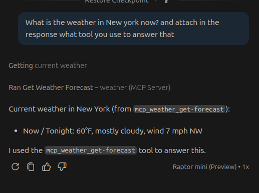
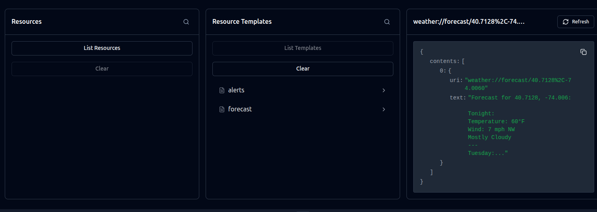
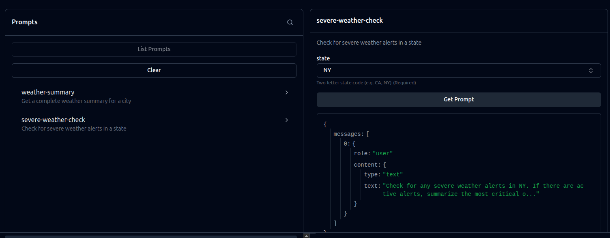

# NOTES

## MCP flow

```text
LLM Host (Copilot, Claude Desktop, Cursor...)
    ↕ MCP Protocol
Servidor MCP // built-in tools in this case get-alerts and get-forecast
    ↕
APIs / Database / System file...
```

## Testing

### Tool

```text
What is the weather in New york now? and attach in the response what tool you use to answer that
```

and the anwser was:



## Resources

Using the MCP Inspector I send a request to 40.7128,-74.0060 coordinates to get the forecast



## Prompt

Using the MCP Inspector I send a request to NY city severe weather


